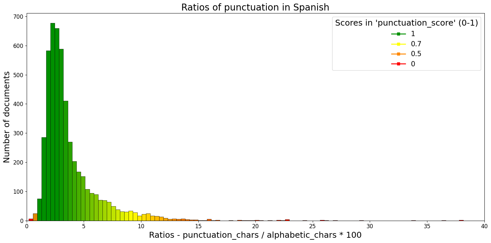
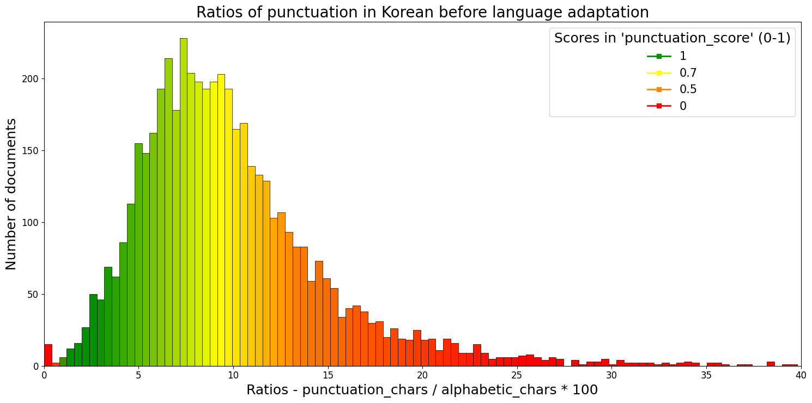
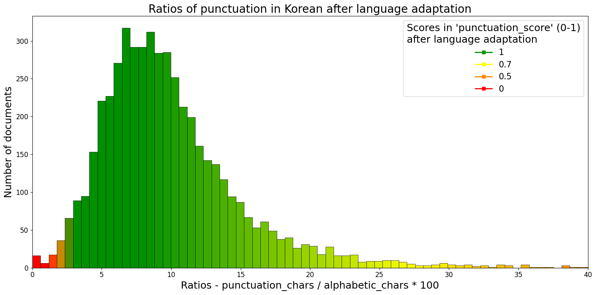

# Quality text tagger

Quality Text Tagger is an application that analyzes monolingual documents (from crawled websites) and gives them a quality score that works as a measure of how good or bad the document is (see below). The score is on a  0 (really bad document) to 10 (very good document) scale, and it's obtained by taking into account textual indicators and metadata. 

Good documents (scores 5-10) are those mainly made of linguistic data, containing a big portion of running distributed across long and well constructed paragraphs. Conversely, bad documents (scores 0-4) are mainly made of non-linguistic characters (like code or emojis) or contain an excess of numbers, puctuation symbols, segment repetitions, etc.  

Quality Text Tagger requires the input documents to be formatted in JSONL, containing the same fields as the documents in the HPLT 1.2 version (see an example of the format [here](https://hplt-project.org/datasets/v1.2)). The current implementation assumes that each document contains information about language identification (at document and segment level), and the text itself with segment boundaries (i.e. `/n`) which (roughly) correspond to paragraphs. 

# Table of contents

**to do!**

 
## How does the tagger work

In order to give a **_quality_score_** to a document, the quality text tagger computes several subscores over its content and metadata. Note that higher is always better:

| Subcore  |  Based on   |  Scale   | 
|---|---|---|
| language_score | ratio of characters in the correct language vs. total characters | 0 - 10 | 
| big_segments_score | amount of long segments (alphabetic characters) | 0 - 1 | 
| largest_segments_score | length of largest text segments | 0 - 1 | 
| urls_score | ratio of urls vs. total segments | 0 - 1 | 
| numbers_score | ratio of [numeric characters](https://gitlab.prompsit.com/hplt/quality-text-tagger/-/blob/main/README.md#glossary) vs. alphabetic characters| 0 - 1 | 
| punctuation_score | ratio of [punctuation characters](https://gitlab.prompsit.com/hplt/quality-text-tagger/-/blob/main/README.md#glossary) vs. alphabetic characters| 0 - 1 | 
| bad_chars_score | ratio of [bad characters](https://gitlab.prompsit.com/hplt/quality-text-tagger/-/blob/main/README.md#glossary) (emojis, non word punctuation, separators, etc.) vs. alphabetic characters | 0 - 1 | 
| repeated_score | ratio of repeated segments | 0 - 1 | 

A detailed description about these subscores is given in section [Computing subscores](https://gitlab.prompsit.com/hplt/quality-text-tagger/-/blob/main/README.md#computing-subscores). 

### Computing the _quality_score_

processed with: `crawled_text_qualifier.valorate_text()`

The _quality_score_ takes the above described set of subscores and combines them as follows:

1. First, a **_basic_score_** is obtained by adding the subscores that represent positive aspects of the document content: 
  * _language_score_ 
  * _big_segments_score_
  * _largest_segments_score_

`basic_score`= `language_score * 0.8 + big_segments_score + largest_segments_score`

Note that the _language_score_ is weighted (since it scores from 0 to 10, while the other values score 0 to 1), so the maximum possible value of the _basic_score_ is 10.

2. Then, we use the rest of the subscores (which represent negative aspects of the document content (_urls_score_, _numbers_score_, _punctuation_score_, _bad_chars_score_, _repeated_score_)) to compute a **_penalty_score_** by using the following formula:

`penalty_score` = `first_minor_negative_subscore_value * second_minor_negative_subscore_value * average (remaining_negative_subscores_values) `

`first_minor_negative_subscore_value` and `second_minor_negative_subscore_value` are the two features with the lowest score.  Please, see section [Computing the _penalty_score_](https://gitlab.prompsit.com/hplt/quality-text-tagger/-/blob/main/README.md#computing-the-penalty_score) for more details.

3. Finally, we get the final **_quality_score_** by multipliying the **_basic_score_** by the **_penalty_score_**: 

`quality score` = `basic score * penalty score`

### An example of the _quality_score_

We show a practical example on how the **_quality_score_** is computed and its meaning for a document from the HPLT v1.2 Italian dataset. 

This is an excerpt of a whole document from this dataset that can be found in `example/example1.jsonl`:

> [...]
> 
> _La frase con 把 è usata per rispondere:_
> 
> _Dove disporre una persona o una cosa (collocazione spaziale come conseguenza dell’azione)?_
> 
> _Come disporre una persona o una cosa (disposizione con la modalità espressa dall’azione come conseguenza)_
> 
> _Ti interessa saperne di più? Continua a seguirmi, e fai le tue domande che non credo ..._ 
> 
> [...]

From this document, we get these subscores: 

| Subcores  |    Value      |
|---|---|
| language_score | 9.9 |
| big_segments_score | 0.4 |
| largest_segments_score | 1.0 |
| url_score | 1.0 |
| punctuation_score | 1.0 |
| bad_chars_score | 1.0 |
| numbers_score | 0.92 |
| repeated_score | 0.96 |

The document **_quality_score_** is computed using these subscores values as above explained:  

**basic score** = 9.9 x 0.8 + 0.4 + 1 = **9.32**

**penalty score** = 0.92 x 0.96 x ((1+1+1)/3) =  **0.88**

**quality score** = 9.32 x 0,88 = **8.2** 

This means that we have a good document (**_quality_score_** = 8.2/10), undoubtedly in Italian (_language_score_ = 9.9/10). It probably contains a considerable amount of linguistic data in one or two segments (_largest_segment_score_ = 1/1), but it only contains 4 long segments of a maximum of 10 (_big_segments_score_ = 0.4/1).

The document does not contain url, punctuation or bad characters noise (_url_score_ = 1/1, _punctuation_score_ = 1/1, _bad_chars_score_ = 1/1). It contains a small excess of numbers (_numbers_score_ = 0.92/1), which could be due to the presence of a calendar present in the text:

> [...] _Gennaio 2022 Giugno 2021 \n Marzo 2021 \n Novembre 2020 \n Ottobre 2020..._ [...]

And it has a few repeated segments (_repeated_score_ = 0.96/1) of recurrent headers or titles:

>[...] Grammatica, livello avanzato [...]
> Grammatica, livello avanzato [...]

### Another example of the quality_score

The following excerpt belongs to the file `example/example2.txt`, a Chinese document from the HPLT v1.2 dataset which got a **quality_score** of 1.5:

> [...]
>  
> www.34449com-www,67617,com  
> 
> 首页 | 认证专区 | 论坛 | 博客 | 人才 | 频道 | 名人堂 | 自测 | 文库 | 沙龙  
> 
> 博客首页往日推荐排 行 榜博客文集专题荟萃专  家认证专区  
> 
> 8686123白小姐9999911111香港曾半仙www.66575.com472222刘伯
> 温开奖www,df011,comwww993997.com
> 
> 全部分类
> 
> 数据库
> 
> [...]

We compute the subscores: 

| Subscore  |    Value      |
|---|---|
| language_score | 8.0 |
| big_segments_score | 0.1 |
| largest_segments_score | 0.0 |
| url_score | 0.44 |
| punctuation_score | 0.9 |
| bad_chars_score | 1 |
| numbers_score | 0.56 |
| repeated_score | 1 |

This text seems to be made of mainly short sentences (note the very low values for _big_segments_score_ and _largest_segments_score_) and even from some mix of languages according to the language identifier. This makes the basic score already a low one: 

|basic score| Result |
|---|---|
|8 * 0.8 + 0.1 + 0| 6.5 |

The document does not seem to have bad punctuation, or characters and it does not contain repeated sentences, but it has an excess of numbers and urls. This impacts highly the _penalty_score_ value:

|penalty score| Result |
|---|---|
|0.44 * 0.56 * 0.97| 0.24 |

Thus, the final _quality_score_ is also very low:

|basic score * penalty score| Result |
|---|---|
| 6.5 * 0.24| 1.5 |

This document is considere an undesirable document. 

## Usage

#### crawled_text_qualifier.py (main script)

Parameters 
- **--input** directory with jsonl files provided by the language identifier
- **--output:** existing directory

Output
- will create one csv for each jsonl file.
- columns: quality_score, language_score, url_score, punctuation_score, bad_chars_score, numbers_score, repeated_score,n_big_segments_score, great_segment_score

Requisites

- document `./language_adaptation/medians_language.csv` created by `./language_adaptation/extract_ratios.py` with samples of data

#### quality_score_charts.py

Parameters 
- **--input** directory with csv files created by `crawled_text_qualifier.py`
- **--output:** existing directory

Output
- HTML document with histograms about all languages present in the input

#### language_adaptation/extract_ratios.py

- **--input** directory with jsonl files with HPLT 1.2v like structure of key and values
- **--output:** existing directory

Output
- CSV that contains the medians of numbers, punctuation and bad characters ratios in every language present in the directory

## Computing the _penalty_score_

processed with: `crawled_text_qualifier.custom_mean()`

The subscores used to compute the **_penalty_score_** are: _urls_score_, _numbers_score_, _punctuation_score_, _bad_chars_score_ and _repeated_score_.

These subscores represent negative aspects of the document content. They range on a scale from 0 to 1, where 1 means that no penalization should be applied. Bellow 1, 0.8 will have an important effect in the final score and less than 0.5 will penalize it severely. A 0 value in any of these scores thus means that the resulting value will be 0 in any case.

To compute the _penalty_score_, the two lowest values from the above mentioned subsscores are multiplied by the average of the rest of values:

`first_minor_value * second_minor_value * average(other_values)`

We prefer this solution to a simple average because the aim of these scores is to advertise about documents that stand out of the desidered ratios. A classical average would overshadow low values, which are the most precious to our goal, and a simple multiplication of all scores would make it hard to work with more than 4 or 5 penalty variables.

## Computing subscores

### language_score

processed with: `crawled_text_qualifier.valorate_lang()`

The _language_score_ gets a value from 0 to 10 linked to the amount of segments in the correct language inside a document. It uses the information about language at segment and document level provided as metadata in the input files. Segments whose language matches the document language are considered correct and segments with a different language are considered wrong. We use word characters to obtain a proportion of correct and incorrect characters in the document and to provide a score as follows:

`correct_characters / (correct_characters + wrong_characters) * 10`

This score is not sensitive to short segments, which very frequently correspond to header or footer menus, social media listing, partners listing, etc. These strings are troublesome for language identifiers as they are usually classified as English or other random language. For this reason, segments with _n_ or less word characters are ignored in this processing. The _n_ value is different according every language. For example, 25 is considered the minimum number of characters for Spanish segments.

### big_segments_score and largest_segments_score

processed with: `crawled_text_qualifier.valorate_big_texts()`

These two scores get values between 0 and 1 that aim to determine the presence of big groups of word characters in the correct language.

For the _big_segments_score_, a document will recieve a 0.1 score point for every big segment up to a maximum score of 1. The length of what we consider a 'big segment' depends on each language and is measured using word characters. In Spanish, we set the minimum number of word characters to 250 but in English, for example, the minimum is 232. For more details about language adaptation see the [Adapting subscores to different languages](https://gitlab.prompsit.com/hplt/quality-text-tagger/-/blob/main/README.md#adaptating-subscores-to-different-languages) section.

On the other hand, the _largest_segments_score_, is used to measure if documents contain at least one very big segment. The lenght of what we consider a 'very big segment' is also language-dependent. In Spanish, a segment of this kind has between 625 and 1000 word characters as a point of reference for our minimum an maximum numbers. Depending on lenght, we assign a value from 0 to 1. If a segment of 1000 word characters (or more) is found in a Spanish document it will recieve a 1 score and if a document only contains segments with 625 or less word characters the resultant _largest_segments_score_ will be 0. If there is more than one of these segments, we use an average of them.

### urls_score

processed with: `crawled_text_qualifier.valorate_urls()`

To obtain this score, we look for the number of urls in a document. In particular, we look for "www" or "http" strings in the whole text. We search the ratio between the number of urls and the number of segments in the text. We ignore short segments, as for the _language_score_. The _urls_score_ is language independent and is computed as follows:

`number_of_urls / number_of_segments * 100`

Documents with 5 or less urls each 100 segments is set as the upper ratio threshold, penalization is applied when more than 5 url are present as follows:

| Url score  |    Ratio      |
|---|---|
| 1 | <5 |
| 1 → 0.5 | 5 → 30 |
| 0.5 → 0 | 30 → 100 |
| 0 | >100 |

### numbers_score

processed with: `crawled_text_qualifier.valorate_numbers()`

This score is used to determine if there is a high number of numeric characters in a document. It is computed by comparing the ratio of numbers and word characters:

`numbers_characters / word_characters * 100`

The ratio threshold and its matching score depends on every language. In Spanish, for example, we assign scores as follows:

| Number score  |    Ratio      |
|---|---|
| 1 | <1 |
| 1 → 0.7 | 1 → 10 |
| 0.7 → 0.5 | 10 → 15 |
| 0.5 → 0 | 15 → 30 |
| 0 | >30 |

### punctuation_score

processed with: `crawled_text_qualifier.valorate_punctuation()`

This score is used to penalize texts with too much or too little amount of punctuation. The ratio is calculed this way:

`punctuation_characters / word_characters * 100`

The threshold for this ratio and its matching scoring is language-dependent. In Spanish we give the next scores to the following ratios:

| Punctuation score  |    Ratio      |
|---|---|
| 1 | 0.9% → 2.5% |
| __Too much__  | |
| 1 → 0.7 | 2.5% → 9% |
| 0.7 → 0.5 | 9% → 13% |
| 0.5 → 0 | 13% → 25% |
| 0 | >25% |
| __Too few__  | |
| 0 → 0.5 | 0.9% → 0.5% |
| 0.5 → 0 | 0.5% → 0.3% |
| 0 | <0.3% |

Not only too much punctuation is problematic, but also too few, usually leading to documents that contain a list of products, tags, SEO phrases, etc.

### bad_chars_score

processed with: `crawled_text_qualifier.valorate_bad_chars()`

The _bad_chars_score_ is used to penalize texts with undesired characters:

`bad_characters / word_characters * 100`

The threshold for this ratio and its matching scoring is language-dependent. In Spanish we give the next scores to the following ratios:

| Bad chars score  |    Ratio      |
|---|---|
| 1 | <1% |
| 1 → 0.7 | 1% → 2% |
| 0.7 → 0.5 | 2% → 6% |
| 0.5 → 0 | 6% → 10% |
| 0 | >10% |

### repeated segments (repeated_score)

processed with: `crawled_text_qualifier.valorate_repeated()`

This score computes the proportion of repeated segments. Short segments are ignored using the same logic as the for language score processing. For example, 0% of repeated segments will get a 1 score, 20% of repeated segments will have a 0.8 and 100% of repeated segments will recieve a 0 score. 

## Adaptating subscores to different languages 

processed with: `language_adaptation.extract_ratios()`, `crawled_text_qualifier`

Some of the subscores used to get the _quality_score_ are based on ratios that need to be computed for each language for optimal performance. These are: _punctuation_score_, _bad_chars_score_, _numbers_score_, _big_segments_score_, _largest_segments_score_ and 'short segments' that are ignored in several processing.

In our experiments, as a first approach, we stablished the desidered ratios for each indicator in Spanish, using a sample  from HPLT v1.2. These ratios will be valid only for this language, so an adaptation method is needed.

To adapt the values to other languages we used the scores and the labels provided as metadata in HPLT v1.2. Using a random sample of 10k documents per language, we select the 50% best language-scored documents and compute ratios for the punctuation, bad characters and numbers subscores. Medians for each subscore are computed and stored in `language_adaptation/medians_language.csv` using the script `language_adaptation/extract_ratios.py`. (GEMA: review this). Medians are is used in the main script (`crawled_text_qualifier.py`) to create equivalences between ratio and scores. (GEMA: and this)

The application of the Spanish ratios-score logic to other languages which differ considerably from it, as shown in the following histograms, produces innacurate _quality_scores_ in Korean which penalize undesirably documents that look good:

To solve this problem we decided to use medians as a point of reference to set more accurate score ranges. In this case, Korean has a median of 7.3 and Spanish 2.4. We use this information to make a cross-multiplication so we get a new and adapted score-ratio relation:

Using another example, the median of both Russian and Spanish for bad chars, is the same (0.8), so no adjustments are needed. However, for regular punctuation the median is different: 3.2 for Russian and 2.4 in Spanish. In this case adjustments are needed. The main script uses again, a cross-multiplication to solve this. If we take the 0.9 ratio which in Spanish is considered a 1/1 score, this means that Russian needs a 1.2 ratio to get a 1/1 socre in the _punctuation_score_:

`(3.2 * 0.9) / 2.4 = 1.2`

Consequently, the adapted table for Russian concerning the _punctuation_score_ is as follows:

| Punctuation score  |    Ratio Spanish      | Ratio Russian |
|---|---|---|
| 1 | 0.9 → 2.5 | 1.2 → 3.3 |
| __Too much__  |
| 1 → 0.7 | 2.5 → 9 | 3.3 → 12 |
| 0.7 → 0.5 | 9 → 13 | 12 → 17.3 |
| 0.5 → 0 | 13 → 25 | 17.3 → 33.3 |
| 0 | >25 | >33.3 |
| __Too few__  |
| 0 → 0.5 | 0.9 → 0.5 | 1.2 → 0.67 |
| 0.5 → 0 | 0.5 → 0.3 | 0.67 → 0.4 |
| 0 | <0.3 | <0.4 |

Not only the relative values are adapted (_punctuation_score_, _bad_chars_score_, _numbers_score_), also some absolute values need to be more flexible depending on the language. For example, punctuation ratios are used to adapt the values of _big_segments_score_, _largest_segments_score_ and what we called 'short segments', which are ignored to compute some scores. For example, in Spanish we use 1000 word characters as a reference for _largest_segments_score_ with a median of 2.4 in punctuation characters. However, in Japanese, with a median of 6.5, 369 characters is enough according to the inverse cross-multiplication:

`2.4 * 1000 / 6.5`

The relationship between punctuation and word characters is inversely proportional: as the number of punctuation symbols per word characters increases, the average number of word characters decreases. (GEMA: revisar esto. )

## Glossary
- _document_: whole text of a crawled website
- _segment_: every string grouped between a `\n` character
- _x type character_: see next table

| Name  |  Meaning   |  utf-8 ranges   |
|---|---|---|
|number character|Numbers in many languages|0030-0039, 0660-0669, 06F0-06F9, 0964-096F, 09F2-09F9, 0B66-0B77, 0BE6-0BFA, 0C66-0C6F, 0C78-0C7E, 0CE6-0CEF, 0D66-0D79, 0DE6-0DEF, 0E50-0E5B, 0EC0-0ED9, 1040-1049, 1090-1099, 1369-137C, 17E0-17E9, 1810-1819, 19D0-19DA, 1A80-1A99, 1B50-1B59, 1C40-1C49, 1C50-1C59, A830-A839, A8D0-A8D9, AA50-AA59|
|punctuation character|Most frequent linguistic punctuation|0021-0022, 0027-0029, 002C-002E, 003A-003B, 003F, 005B, 005D, 0060, 00A1, 00B4-00B5, 00B7, 00BF,0589-05C7, 0600-061F, 066A-066D, 06D4-06ED, 0700-070F, 1360-1368, 1800-180A, 1AB0-1AFF, 1C78-1C7F, 1CC0-1CC7, 1FBD-1FC1, 1FCD-1FCF, 1FDD-1FDF, 1FED-1FEF, 1FFD-2027, 3000-303F, 4DC0-4DFF, A6F0-A6F7, FE10-FE6F|
|bad character|Non typical linguistic punctuation, emojis, separators, etc.|0023-0026, 002A-002B, 002F, 003C-003E, 0040, 005C, 007C, 007E, 00A2-00B3, 00B8-00BE, 00D7, 00F7, 02B0-0385, 0483-0489, 0559-055F, 2010-2E52, 10000-1FFFF, A670-A67F, 3200-33FF|
|space character|White spaces, tabulations, new lines, etc.|0000-0020, 007F-00A0, 2B7E, 008A, 0088|
|word character|Characters that are used to create lexical units or words| Any character not in the other groups |

