# Web Docs Scorer

Web Docs Scorer (WDS) is a Python application that analyzes monolingual documents whose text has been extracted from crawled websites and assigns them a score that reflects their overall quality (see below). The score ranges from 0 (low-quality document) to 1 (high-quality document), and it is obtained by taking into account textual indicators and metadata.

Good quality documents (scores 0.5-1) are ideally those mainly made of linguistic data, containing large portions of text distributed across long and well-formed paragraphs. Conversely, bad quality documents (scores 0-0.4) are mainly made of non-linguistic characters (like code or emojis) or contain an excess of numbers, puctuation symbols, URLs or repetitions. Those that include a large number of websites artifacts, like boilerplates or SEO words/phrases lacking in cohesion with the rest of the text

Semantic or thematic issues of the documents are, so far, not taken into consideration; only the structural or surface features of the text are used to make the score and subscores. Just aspects like the type of characters, their repetition, their length or their proportion are taken into account. This decision is based on the fact that the application is intended to be as lightweight as possible and, in addition, aims to cover all possible languages without delving into the particularities of each one.

The current implementation assumes that each document has been annotated with information about language identification (at document and segment level), and the text itself with segment boundaries (`\n`), which (roughly) correspond to paragraphs, these are needed to separate into [segments](#glossary). For more information about the input data see the [usage](#usage) section.

# Table of contents

1. [How does the WDS work](#how-does-the-WDS-work)
   1. [Computing the _WDS_score_](#computing-the-WDS_score)
   2. [An example of the _WDS_score_](#an-example-of-the-WDS_score)
   3. [Another example of the _WDS_score_](#another-example-of-the-WDS_score)
2. [Usage](#usage)
   1. [docscorer.py (main script)](#docscorerpy-main-script)
   2. [WDS_score_charts.py](#WDS_score_chartspy)
   3. [language_adaption/extract_ratios.py](#language_adaptionextract_ratiospy)
3. [Computing the _penalty_score_](#computing-the-penalty_score)
4. [Computing subscores](#computing-subscores)
   1. [language_score](#language_score)
   2. [long_segments_score and superlong_segments_score](#long_segments_score-and-superlong_segments_score)
   3. [urls_score](#urls_score)
   4. [numbers_score](#numbers_score)
   5. [punctuation_score](#punctuation_score)
   6. [singular_chars_score](#singular_chars_score)
   7. [repeated_score](#repeated-segments-repeated_score)
   8. [informativeness_score](#informativeness_score)
   9. [short_segments_score](#short_segments_score)
5. [Adaptating subscores to different languages](#adapting-subscores-to-different-languages)
6. [Glossary](#glossary)

## How does the WDS work

In order to give a **_WDS_score_** to a document, the WDS computes several subscores over its content and metadata. Note that higher is always better:

| Subscore                  | Based on...                                                                                                         | Scale  |
| ------------------------ | ---------------------------------------------------------------------------------------------------------------- | ------ |
| [language_score](#language_score)           | number of [alphabetic characters](#glossary) in the correct language compared with overall number of alphabetic characters                             | 0 - 1 |
| [urls_score](#urls_score)               | number of URLs compared with [alphabetic characters](#glossary)                                                                                 | 0 - 1  |
| [punctuation_score](#punctuation_score)        | number of [punctuation characters](#glossary) compared with [alphabetic characters](#glossary)                                             | 0 - 1  |
| [singular_chars_score](#singular_chars_score)     | number of [singular characters](#glossary) compared with [alphabetic characters](#glossary) | 0 - 1  |
| [numbers_score](#numbers_score)            | number of [numeric characters](#glossary) compared with [alphabetic characters](#glossary)                                                   | 0 - 1  |
| [repeated_score](#repeated_score)           | number of repeated [segments](#glossary)                                                                                      | 0 - 1  | 
| [n_long_segments_score](#long_segments_score-and-superlong_segments_score)      | amount of long [segments](#glossary)   ([alphabetic characters](#glossary))                                                                  | 0 - 1  |
| [great_segment_score](#long_segments_score-and-superlong_segments_score) | length of greatest [segments](#glossary)                                                                             | 0 - 1  |
| [informativeness_score](#informativeness_score)           |     compression ratio using zstandard                                                                                   | 0 - 1  |
| [short_segments_score](#short_segments_score)          |     fluctuation of segments length using the coheficient of variation of the [alphabetic characters](#glossary)                                                                                | 0.5 - 1  |

All the numerical parameters that make up the subscores —thresholds and ratios- are manually selected based on samples from HPLT v1.2. In cases where the subscore is language-dependent, Spanish is used as the reference language. For these cases, adaptation to other languages is performed as explained in the [Adaptating subscores to different languages](#adapting-subscores-to-different-languages) section. In other cases, when the subscore is language-independent, the reference values are taken from samples in various languages.

A detailed description about these subscores is given in section [Computing subscores](#computing-subscores).

### Computing the _WDS_score_

The  _WDS_score_ is computed by `DocumentScorer.score_document()`. It combines the aforementioned set of subscores as follows:

1. First, a **_basic_score_** is a weighted sum of the subscores that represent positive aspects of the document content:

* [language_score](#language_score)
* [n_long_segments_score](#long_segments_score-and-superlong_segments_score)
* [great_segment_score](#long_segments_score-and-superlong_segments_score)

`basic_score = language_score * 0.8 + n_long_segments_score * 0.1 + great_segment_score * 0.1`

Note that the _n_long_segments_score_ and the _great_segment_score_ are weighted (x * 0.1) in order to maintain the 0-1 scale.

2. Then, we use the rest of the subscores, which represent negative (or penalizable) aspects of the document content, to compute a **_penalty_score_**:

* [urls_score](#urls_score)
* [numbers_score](#numbers_score)
* [punctuation_score](#punctuation_score)
* [singular_chars_score](#singular_chars_score)
* [repeated_score](#repeated_score) 
* [informativeness_score](#informativeness_score)
* [short_segments_score](#short_segments_score)

Please, see section [Computing the _penalty_score_](#computing-the-penalty_score) for more details on how subscores are computed.

3. Finally, we get the final **_WDS_score_** by multipliying the **_basic_score_** by the **_penalty_score_**. Note that _penalty_score_ is always 0-1 and _basic_score_ is always 0-1:

`WDS_score = basic_score * penalty_score`

### An example of the _WDS_score_

In this section we show an example on how the **_WDS_score_** is computed, and the meaning of its subscores. The document is extracted from the HPLT v1.2 English dataset, and can be found in `example/example1.jsonl`. An excerpt of the document is shown below:

> [...]
> 
> _La frase con 把 è usata per rispondere:_
> 
> _Dove disporre una persona o una cosa (collocazione spaziale come conseguenza dell’azione)?_
> 
> _Come disporre una persona o una cosa (disposizione con la modalità espressa dall’azione come conseguenza)_
> 
> _Ti interessa saperne di più? Continua a seguirmi, e fai le tue domande che non credo ..._ 
> 
> [...]


From this document, we get these subscores: 

| Subcores  |    Value      |
|---|---|
| language_score           | 0.99   |
| url_score                | 1.0  |
| punctuation_score        | 1.0   |
| singular_chars_score     | 1.0   |
| numbers_score            | 0.92  |
| repeated_score           | 0.89     |
| n_long_segments_score      | 0.4   |
| great_segment_score | 1.0   |
| informativeness_score           | 1.0     |
| short_segments           | 0.84     |


As explained in the section above, the **_WDS_score_** of the document is computed by using these subscores values:

**basic score** = (0.99 * 0.8) + 0.4 * 0.1 + 1.0 * 0.1 = **0.93**

**penalty score** = [custom_geometrical_average](#computing-the-penalty_score)(1.0, 1.0, 1.0, 0.92, 0.89, 1.0, 0.84) = **0.83**

**WDS score** = 0.93 * 0.83 = **0.77** 

This means that the previous example is a desired document (**_WDS_score_** = 0.77), that is clearly in Italian (_language_score_ = 0.99). It probably contains a considerable amount of textual data in some segments (_great_segment_score_ = 1.0), because there is almost one 'very long segment', but it only contains 4 'long segments' (_n_long_segments_score_ = 0.4). For Italian we consider 'very long segments' those with more than 1208 alphabetic characters and to be considered a 'long segment' almost 302 alphabetic characters are needed. For more information about these scores see the [long_segments_score and superlong_segments_score](#adaptating-subscores-to-different-languages) sections.

The document does not contain enough URLs, punctuation or singular characters noise to be penalized because of it (_url_score_ = 1.0, _punctuation_score_ = 1.0, _singular_chars_score_ = 1.0). It contains a small excess of numbers (_numbers_score_ = 0.92), which could be due to the presence of a calendar present in the text. This calendar also trigger the _short_segments_score_ (0.84) because it is composed of many segments that are clearly shorter than the other segments:

> [...] _Gennaio 2022 Giugno 2021 \n Marzo 2021 \n Novembre 2020 \n Ottobre 2020..._ [...]

The document also has some repeated segments (_repeated_score_ = 0.89) caused by recurrent headers or titles:

>Grammatica, livello avanzato 
>
>[...]
>
>Grammatica, livello avanzato

or

>Commenti
>
>[...]
>
>Commenti


### Another example of the _WDS_score_

The following excerpt belongs to the file `example/example2.txt`, an English document from the HPLT v1.2 dataset. The document got a **_WDS_score_** of 0.0:

>#Travel #Motivation #lovelife #livelifetothefull #Travelgram #Livelovelearn #Happiness #Onelifeoneshot #lifeiswonderful

We compute the subscores:

| Subcores  |    Value      |
|---|---|
| language_score           | 1.0   |
| url_score                | 1.0  |
| punctuation_score        | 0.0   |
| singular_chars_score     | 0.54   |
| numbers_score            | 0.94  |
| repeated_score           | 1.0     |
| n_long_segments_score      | 0.0   |
| great_segment_score | 0.0   |
| informativeness_score           | 0.69     |
| short_segments           | 1.0     |

In this case, we see a English text (_language_score_ 1.0). It contains a small excess of numers (_numbers_score_ = 0.94) but a large number of singular characters (_singular_chars_score_ = 0.54), in this case the "#". It is also less compressible than expected by zstandard (_informativeness_score_ = 0.69). Anyway, the most important subscore in this case is the _punctuation_score_. For this quantity of linguistic characters in English at least one punctuation mark is expected. Thus the lack of punctuation makes the _punctuation_score_ drop to the 0 score.

If we make the calculation:

**basic score** = (1.0 * 0.8) + 0.0 * 0.1 + 0.0 * 0.1 = **0.8**

**penalty score** = [custom_geometrical_average](#computing-the-penalty_score)(1.0, 0.0, 0.54, 0.94, 1.0, 0.69, 1.0) = **0.0**

**WDS score** = 0.8 x 0.0 = **0.0**

Note that the presence of any very low subscore has a deep impact in the penalty score and therefore in the WDS final score.

## Usage

### /src/docscorer/docscorer.py

This is the main script, it will analyze the document using the class DocumentScorer and his function score_document(). This class needs a configuration parameter, it is constructed with the class ScorerConfiguration found in _/src/docscorer/configuration.py_.

The function requires the following parameters:

#### Parameters

- ``ref_lang``: 3 character ISO 639-3 language code (_eng_, _cmn_).
- ``ref_script``: 4 character ISO 15924 script system code (_latn_, _hans_).
- ``lang_segments``: json formatted list of languages and scripts separated by "_" (["_eng_latn_", "_ell_latn_"]).
- ``document_text``: the text of the document. Remember that every segment division has to be indicated with `\n`. The number of segments should always correspond to the number of _lang_segments_, which must be correlated.
- ``doc_id``: any string to use as id.
- ``raw_score``: True or False value (False by default). It makes the function return only the WDS_score if True. If False is selected the script will return the WDS score and all subscores.

#### Example


><font color="#569CD6">from</font> docscorer.configuration <font color="#569CD6">import</font> ScorerConfiguration  
><font color="#569CD6">from</font> docscorer.docscorer <font color="#569CD6">import</font> DocumentScorer  
><font color="#9CDCFE">config</font> = <font color="#9CDCFE">ScorerConfiguration</font>()  
><font color="#9CDCFE">scorer</font> = <font color="#9CDCFE">DocumentScorer</font>(config)
>
><font color="#9CDCFE">ref_language</font> = <font color="#CE9178">"spa"</font>  
><font color="#9CDCFE">ref_script</font> = <font color="#CE9178">"latn"</font>  
><font color="#9CDCFE">lang_segments</font> = [<font color="#CE9178">'spa_Latn'</font>, <font color="#CE9178">'spa_Latn'</font>, <font color="#CE9178">'spa_Latn'</font>, <font color="#CE9178">'spa_Latn'</font>]
><font color="#9CDCFE">document_text</font> = <font color="#CE9178">"Seguramente has escuchado decir que el amor es ciego..."</font>  
><font color="#9CDCFE">doc_id</font> = <font color="#CE9178">"0"</font>  
>
><font color="#9CDCFE">scorer</font>.<font color="#9CDCFE">score_document</font>(  
    ref_lang=ref_language,  
    ref_script=ref_script,  
    lang_segments=lang_segments,  
    document_text=document_text,  
    doc_id=doc_id,  
    raw_score=<font color="#569CD6">False</font>  
)

#### src/docscorer/configuration/language_adaption/extract_ratios.py

This script extracts the median ratios of numbers, punctuation and singular characters which are used to process the [language adaption](#adaptating-subscores-to-different-languages) from a sample of documents. This works as a ‘model’ for WDS. Its purpose is to create a CSV containing data from a sample of texts that are intended to be representative, diverse, and comparable. By default, the CSV we generated using data from HPLT v1.2 is located at _/src/docscorer/configurations/language_adaption/medians_language.csv_ for default use, but this script can be used to create one that better fits specific needs. The input data must consist in a jsonl file for every language with the structure of HPLT 1.2v.

#### Parameters

- ``input``: directory with jsonl files they must have the HPLT 1.2v like structure regarding keys and values.
- ``output``: existing directory

#### Example

``python3 extract_ratios.py --input=input_dir --output=output_dir ``

## Computing the _penalty_score_

The formula to calculate the penalty_score is:

$$
P = \prod_{i=1}^{n_\mathrm{pen}} P_i^{e_i}
$$


$$
e_i = \frac{\frac{P_i^{-\alpha}}{\sum_{j=1}^{n_\mathrm{P}} P_j^{-\alpha}}}{\beta}

$$

- P: penalty subscore
- $\alpha$: custom value (current 2.9) 
- $\beta$: custom value (current 3.0)


It is weigthed a geometrical average of the penalty subscores ($P$) that boost the worst terms using a custom exponent ($e_i$).

The _penalty_score_ is obtained with `DocumentScorer._aggregate_scores()` . The subscores used to compute the **_penalty_score_** are those that represent the negative aspects of the document:

* [urls_score](#urls_score)
* [numbers_score](#numbers_score)
* [punctuation_score](#punctuation_score)
* [singular_chars_score](#singular_chars_score)
* [repeated_score](#repeated_score) 
* [informativeness_score](#informativeness_score)
* [short_segments_score](#short_segments_score)

The _penalty_score_ ranges on a scale from 0 (the document is severely penalized and gets a final _WDS_score_ of 0) to 1 (no penalization is applied).

We prefer this solution to a simple average because the aim of these scores is to warn about documents that stand out of the desired ratios: a simple average would overshadow low values (which are the most valuable to our goal), while a simple multiplication of all scores would make it hard to work with more than 4 or 5 penalty variables.

## Computing subscores

### Basic data

First of all the relevant numerical data is extracted from the raw text using `/src/docscorer/Docscorer._extract_features()`. It gets the number of punctuation, singular characters and numbers ([Glossary](#glossary)) present in each [segment](#glossary)   of the text. This information will be used by almost all subscores to calculate ratios and score the document.

### language_score

The _language_score_ is processed with the class `src/docscorer/scorers/LangScorer`. It uses the information about language identification at segment and document level (provided as metadata in the input files) in order to get the ratio of [alphabetic characters](#glossary) in the correct language. Segments whose language matches the document language are considered correct and segments with a different language are considered wrong. The _language_score_ is a value that ranges from 0 (worst score) to 1 (best score), and is computed as follows:

`correct_characters / (correct_characters + wrong_characters)`

Segments below a certain length threshold are not taken into account to this metric, so this score is not sensitive to [short segments](#glossary) (which often correspond to header or footer menus, social media listings, partners listings, etc.) These strings are troublesome for language identifiers as they are usually classified as English or other random language. The length threshold is different for each language. For example, 30 [alphabetic characters](#glossary) is considered the minimum acceptable number of characters for taking Spanish segments into account for this metric.

### long_segments_score and great_segments_score

These two metrics are obtained with `src/docscorer/scorers/LongTextScorer`. They get values between 0 and 1 that aim at determining the presence of large groups of alphabetic characters in the correct language.

Regarding the _long_segments_score_, a document receives 0.1 score points for every long segment, up to a maximum score of 1. The length of what we consider a 'long segment' depends on each language and is measured using [alphabetic characters](#glossary). In Spanish, we set the minimum number of alphabetic characters to 250 but in English, for example, the minimum is 232. For more details about language adaption see the [Adapting subscores to different languages](#adapting-subscores-to-different-languages) section.

<!-- [MBG] Consider  normalizing this value with the length of the document, in order to avoid penalizing short documents. -->

On the other hand, the _great_segments_score_ is used to measure whether a document contains at least one very long segment. The lenght of what we consider a 'very long segment' is also language-dependent. In Spanish, a segment of this kind has between 625 and 1000 alphabetic characters. Depending on the length, we assign a value from 0 to 1. If a segment containing 1000 alphabetic characters (or more) is found in a Spanish document, it will receive a score of 1. Likewise, if a document only contains segments with 625 or less alphabetic characters, the resulting _great_segments_score_ will be 0. If there is more than one of these segments (inside both thresholds), we use an average of their lengths to calculate the value.

### urls_score

This score is processed with `src/docscorer/scorers/URLScorer`, by looking at the amount of URLs in a document. In particular, we count the amount of "www" or "http" strings in the whole text, and then we get the ratio between the number of URLs and the amount of [alphabetic characters](#glossary). Depending on the language, we consider a different number of alphabetic_characters per url that we intend good or bad for the document. For example, for Spanish a document is lineally penalized as follows:

| n of urls each  2400 alphabetic_characters   | URL score |
| --------- | --------- |
| <3.0        | 1.0         |
| 3.0 → 10.0   | 1.0 → 0.0  |
| >10.0      | 0.0         |

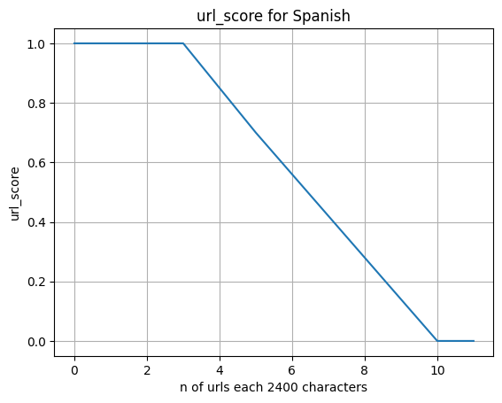

[Short segments](#glossary) are ignored, as for the _language_score_. 

### numbers_score

This metric is processed with `src/docscorer/scorers/NumsScorer`, and it's used to determine whether there is a high number of numeric characters in a document. This is composed by a document-wide base and a per-segment modifier:

`numbers_base * numbers_modifier`

#### numbers_base

 It is computed by getting the percentage of numeric characters compared to alphabetic characters:

`numeric_characters / alphabetic_characters * 100`

This metric and its thresholds are piecewise linear and language-dependent. In Spanish, for example, we assign scores as follows:

| Percentage | numbers_base |
| ------------ | ---------- |
| <1%         | 1.0            |
| 1% → 30%    | 1.0 → 0.0     |
| >30%        | 0.0            |

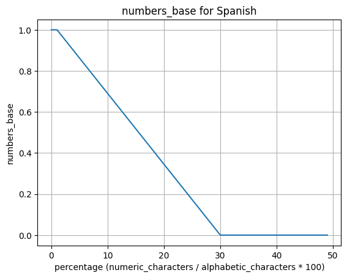

#### numbers_modifier

The _number_modifier_ is used to penalize the accumulation of numbers in particularly troublesome segments. It is language independant. First of all, the ratio of _number_characters_ to _alphabetic_characters_ is calculated by segment. The script saves the amount of numbers by segment that pass the 0.1 ratio as problematic numbers. This per-segment calculation is then converted into a penalty using the following logic:

| Problematic numbers | by segment calculation |
| ------------ | ---------- |
| <50         | 1.0            |
| 50 → 500    | 1.0 → 0.0     |
| >1000        | 0.0            |

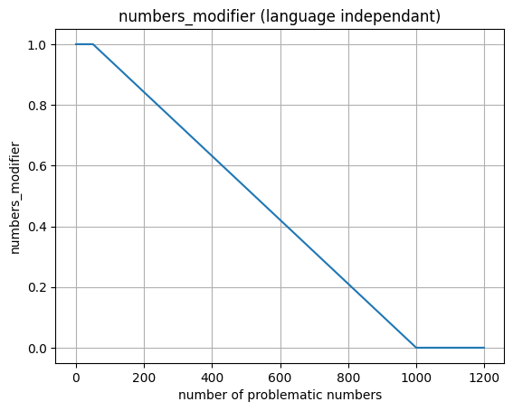


### punctuation_score

The _punctuation_score_ is processed with `src/docscorer/scorers/PunctScorer`. This score is used to penalize texts with too much or too small amount of punctuation characters. This is composed of two different calculations: the _document_punctuation_score_ and the _segment_punctuation_score_. The _document_punctuation_score_ penalizes, at the document level, either a lack or an excess of punctuation. On the other hand, The _segment_punctuation_score_ is designed to detect segments with an excessively low amount of punctuation, which are typically highly problematic. At the end of the process, the lower of the two values is selected as the punctuation_score.

The segments composed by only [punctuation characters](#glossary) and almost 5 characters are always ignored. We assume they are cosmetical delimitators, like "_____" or "----".

#### document_punctuation_score

 For this option, the percentage of [punctuation characters](#glossary) in the overall document is calculed this way:

`punctuation_characters / alphabetic_characters * 100`

Again, this metric and its threshold are piecewise linear and  language-dependent. In Spanish, for example, we give scores according to the following percentages of [punctuation characters](#glossary):

|  Percentage   | Document punctuation score  |
| ------------------ | ------------ |
| __Desired__ |              |
| 0.9% → 2.5% | 1           |       
| __Too much__||
| 2.5% → 25%   | 1 → 0.0           |
| >25%         | 0                  |
| __Too few__  |              |
| 0.9% → 0.5% | 0 → 0.5           |
| 0.5% → 0.3% | 0.5 → 0           |
| <0.3%        | 0                  |

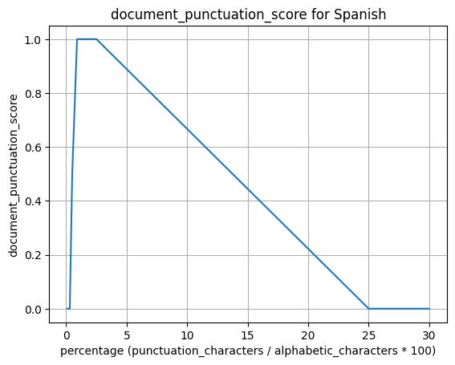
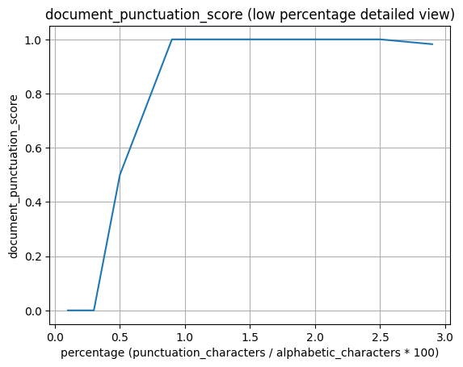

Note that not only too much punctuation is problematic, but also too few, usually caused by documents that consist of product lists, tags, positioning phrases, etc.

#### segment_punctuation_score

This score can also penalize the presence of segments with very few punctuation marks, which are typically SEO or related term lists. For every segment considered problematic due to its lack of punctuation —as indicated by the same calculation: _punctuation_characters_/_alphabetic_characters_ ratio * 100— we record its _alphabetic_characters_. The ratio needed to consider a problematic segment varies by language; for example, in Spanish it is 0.5 or less [punctuation characters](#glossary) every 100 [alphabetic characters](#glossary). Finally, we compute the proportion of _problematic_segments_ to _overall_alphabetic_characters_, and we apply the penalty according to the following table:

| Problematic alphabetic_characters proportion | by segment calculation |
| ------------ | ---------- |
| <0.5%         | 1            |
| 0.5% → 20%    | 1 → 0.6     |
| 20% → 40%  | 0.6 → 0   |
| >40%        | 0            |

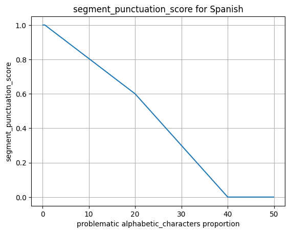


### singular_chars_score

This subscore is computed by `src/docscorer/scorers/SingularCharsScorer`, and it is used to penalize texts with undesired characters (such as emojis, separators, ...). This is composed by a document-wide base and a per-segment modifier:

`singular_chars_base * singular_chars_modifier`

#### singular_chars_base

The base of this subscore is calculated using the ratio of singular characters to the alphabetic characters:

`singular_characters / alphabetic_characters * 100`

This base and its thresholds are piecewise linear and language-dependent. In Spanish, for example, the base distribution is as follows:

| Percentage | singular_chars_base |
| -------------------- | ---------- |
| <1%        | 1                    |
| 1% → 2%   | 1 → 0.7             |
| 2% → 6%   | 0.7 → 0.5           |
| 6% → 10%  | 0.5 → 0             |
| >10%       | 0                    |

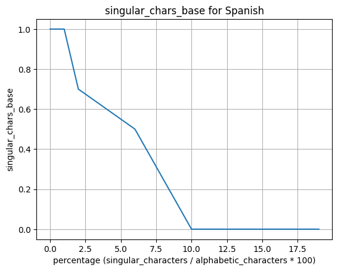

#### singular_chars_modifier

This score also can penalize the accumulation of singular_chars in a single segment. It is language independant. First of all, the ratio of _singular_chars/alphabetic_characters_ is calculated by segment. The script saves the amount of singular_chars by segment that pass the 0.1 ratio as _problematic_singular_characters_. This per-segment calculation is then converted into a digit using the following logic.

| problematic singular_chars | singular_chars_modifier |
| ------------ | ---------- |
| <30         | 1.0            |
| 30 → 150    | 1.0 → 0.0     |
| >250        | 0.0            |

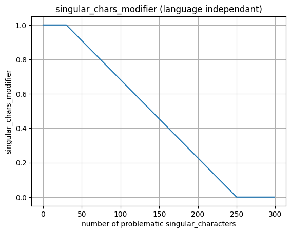


### repeated_score

The _repeated_score_ score is computed by `src/docscorer/scorers/RepeatedScorer`, and it computes the ratio of repeated segments. Segments with
 less than 4 characters are not taken into account for this metric, this is done to avoid treating as repetitions those segments that are typically used for enumeration or for separating sections. The score follows an inverse function of the amount of repeated segments: for example, 0% of repeated segments will get a 1 score, 20% of repeated segments will have a 0.8 and 100% of repeated segments will receive a 0 score. All repeated segments are taken into account, not only the extras.

### informativeness_score

This score attempts to penalize documents with undesirably repeated fragments as well as those composed of random elements that do not follow a common repetition logic, such as hashes or bad decoded texts. It is implemented through the `src/docscorer/scorers/InformativenessScorer` class. This is achieved using the document’s compression ratio. If the ratio deviates from a predefined function, the text is penalized to a greater or lesser extent. These functions are extracted from samples of HPLT v1.2. Functions are the outcome of the average of all document's compression percentage after applying Zstandard. This is represented here: 


In our analysis, the closer the document is to the line, the fewer repetition-related issues it presents. The circles in the following chart summarize our observations: the documents marked in red showed serious issues, while those marked in yellow were somewhat less problematic. Those close to the line did not appear to be documents that should be penalized under this subscore:

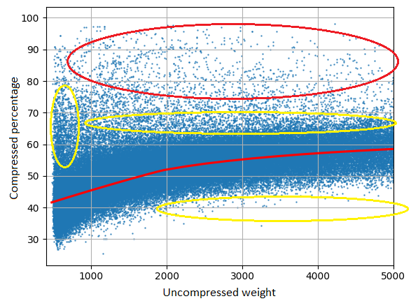

For this score, 4 groups are defined according to the type of writing script, following the list below. This list is composed by the scripts present in HPLT. These are grouped following the behaviour that they showed in our samples. We group them because the lack of documents in HPLT for some languages:

>group_a = ["Grek", "Latn", "Cyrl", "Hang", "Jpan"]\
>group_b = ["Deva", "Beng", "Telu", "Tibt", "Geor", "Gujr", "Khmr", "Knda", "Laoo", "Mlym", "Mymr", "Orya", "Sinh", "Taml", "Thai", "Olck"]\
>group_c = ["Arab", "Armn", "Ethi", "Guru", "Hebr"]\
>group_d = ["Hans", "Hant"]

The compression ratio is calculated as follows:

`1 - (compressed_weight / raw_weight) * 100`

This is a representation of how the penalty function works for Group A based on the relationship between the document’s weight before compression and the percentage of reduction after compression:

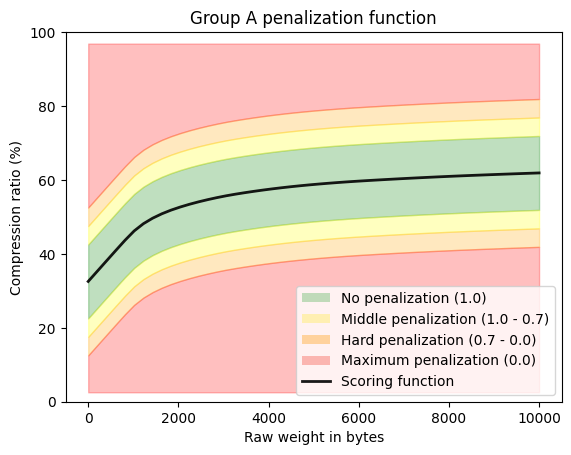

The tool used for compression is Zstandard for Python. The extracted data is compared with the interpolation functions present in `/src/docscorer/configurations/interpolation_functions`.

The samples used lose representativeness beyond a certain weight; therefore, the functions are capped at a specific value, after which the same relationship between penalty and compression ratio is always applied. The maximum weights at which the functions are capped are the following:
- Group A: 180000 bytes
- Group B: 250000 bytes
- Group C: 180000 bytes
- Group D: 75000 bytes

### short_segments_score

This score aims to penalize the presence of very short segments, presumably parts of menus, footers, and other boilerplates. To calculate this score, the [alphabetic characters](#glossary) are extracted. Based on this data, the coefficient of variation of the segment length is calculated, with one modification: segments that exceed a certain threshold are capped at that value. This depends on the language. For example, for Spanish, segments longer than 250 alphabetic characters are flattened to 250 characters. This gives long segments a great deal of stability in the calculation of the coefficient of variation.

The formula used is:

$$
\mathrm{CV} = \frac{\sigma}{\mu} \
$$

Documents that exceed 0.6 in the CV are not penalized. Nor are those documents with fewer than 5 segments. For all other cases, the penalty works as follows:

| CV | short_segments_score |
| ------------ | ---------- |
| 0.0         | 0.5            |
| 0.0 → 0.6    | 0.5 → 1.0     |
| >0.6        | 1.0            |

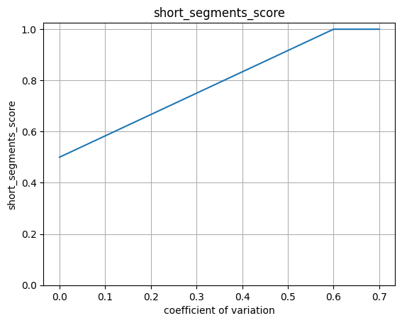

Note that the function is limited to a score between 0.5 and 1.0. This is because we do not want this subscore to have a strong effect on the final score.


## Adapting subscores to different languages

WDS is created using Spanish as the base language to establish the thresholds used to score a web document. To adapt all parameters to other languages, we assume that they behave similarly but on different scales. This assumption is supported by our studies using HPLT, where we observed similar performance across all languages.

This step gets processed with the class `/src/docscorer/configuration/ScorerConfiguration`. Several Python dictionaries, with the needed data, adapted to each language are created in this step. Then every susbcore gets the desired thresholds from this dictionaries.

Some of the subscores used to obtain the _WDS_score_ are based on calculations that need to be computed for each language for optimal performance:

* _punctuation_score_
* _singular_chars_score_
* _numbers_score_
* _long_segments_score_
* _greater_segments_score_
* _short_segments_score

Also what we call '[short segments](#glossary)' (menu_length) threshold, indicating the minimum amount of characters that a segment must have in order to being considered 'short segment', is language-dependent.

In our experiments, as a first approach, we established the desidered ratios and thresholds for each indicator for the Spanish language, by examining a sample  from HPLT v1.2. These ratios are valid for this language only, so an adaption method is needed for other languages.

In order to adapt the values to other languages, we used the language detection scores and labels provided as metadata in HPLT v1.2. from a sample of 10.000 documents per language. Every document was analyzed with a modified version of the [_language_score_](#language_score). In the modified version, the number of correct alphabetic characters of every segment is multiplied by the language identifier probability of the segment. We want to know which documents have the highest proportion of segments and the better probability in the correct language. For example, let us consider a document with three segments; the first one has a language probability of 0.9 and contains 500 alphabetic characters. The second has a low language probability (0.4) and 25 alphabetic characters. The third is not in the correct language and contains only 10 alphabetic characters. The calculation of the modified _language_score_ will be:

```
sum(correct_word_characters * language_probability) / sum(correct_word_characters + wrong_word_characters) * 10

(500 * 0.9 + 25 * 0.4) / (500 + 25 + 10) * 10 = 8.6
```

Using these random samples of 10.000 documents, we selected the 50% best scored documents to extract their ratios for punctuation, singular characters and numbers. The medians of ratios, that we will need for each subscore, were computed with `src/docscorer/configurations/language_adaption/extract_ratios.py` and then stored in `src/docscorer/configurations/language_adaption/medians_language.csv`. Finally, these medians are used in the configuration script (`/src/docscorer/configuration.py`) in order to adapt ratios to every language.

Applying the Spanish ratio-score equivalences to other languages, which can be highly different, produces innacurate _WDS_scores_. The histograms below show an example in Korean, where documents that look good (those grouped between 3 and 15) got penalized. The samples in the pictures are processed with the same ratio-score equivalences that we showed in the table of [_punctuation_score_](#punctuation_score):


Aiming at solving this problem, we decided to use medians as a point of reference to more accurately set score ranges. In the example above, Korean has a median of 7.3 in the punctuation score, while Spanish has a median of 2.4. We used this information to make a cross-multiplication in order to get a new and adapted score-ratio relation:


Using another example, the median of both Russian and Spanish for singular characters is the same (0.8), so no adjustments are needed. However, for punctuation, the median is different: 3.2 for Russian and 2.4 in Spanish. In this case, adjustments are indeed needed. The main script uses, again, a cross-multiplication to solve this and set more appropiate values for Russian. If we consider the _punctuation_score_ table (see table below), in Spanish a ratio between **0.9** and **2.5** is mandatory to get a perfect document (_punctuation_score_ = 1). With the cross-multiplication conversion, we can fit a better benchmark for non penalized documents:

`(3.2 * 0.9) / 2.4 = 1.2`

`(3.2 * 2.5) / 2.4 = 3.3`

As a result, the [adapted table](#punctuation_score) for Russian regarding the _punctuation_score_ is as follows:

| Ratio Spanish        | Ratio Russian | Punctuation score  |
| ------------------ | -------------------- | ------------- |
| __Desired__ |                      |               |
| **0.9** → 2.5 | 1.2 → 3.3    | 1.0                  |
| __Too much__ |                      |               |
| 2.5 → 25.0             | 3.3 → 33.3     | 1.0 → 0.0           |
| >25.0                  | >33.3         | 0.0                  |
| __Too few__  |                      |               |
| 0.9 → 0.5           | 1.2 → 0.67   | 0.0 → 0.5           |
| 0.5 → 0.3           | 0.67 → 0.4   | 0.5 → 0.0           |
| <0.3                 | <0.4          | 0.0                 |

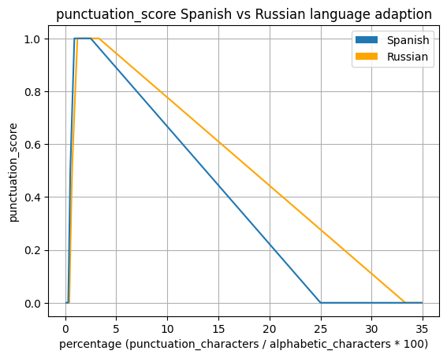

Note that not only the relative values are adapted (_punctuation_score_, _singular_chars_score_, _numbers_score_): some absolute values do also  need to change depending on the language. For example, punctuation ratios are used to adapt the values of _long_segments_score_, _superlong_segments_score_ and what we called '[short segments](#adapting-subscores-to-different-languages)' (the length threshold used to ignore short segments when computing some of the scores). For example, in Spanish we use 1000 alphabetic characters as a threshold for _superlong_segments_score_,  with a median of 2.4 in punctuation characters. However, in Japanese, with a median of 6.5, 369 characters are enough, according to the inverse cross-multiplication:

`2.4 * 1000 / 6.5`

The inverse cross-multiplication is used because the relationship between punctuation and alphabetic characters is inversely proportional. A language that normally uses less alphabetic characters than other will have a bigger ratio of punctuation. For example, in our test sample, German has a punctuation ratio of 2.8, this means that every punctuation mark usually needs 36 alphabetic characters (100/2.8 ≈ 36). In Chinese we found a ratio of 9.9, 10 alphabetic characters are thus needed every 10 alphabetic characters. We use the punctuation as a point of reference to extract the average alphabetic characters of the language, so we can obtain the conversion of what we called long or superlong segments.

In case the analysed language is not present in `src/docscorer/configurations/language_adaption/medians_language.csv`, we use the data of the [WALS](https://wals.info/) to find the closest related languages (within the same script system). This data is condensed in `src/docscorer/configurations/language_adaption/lang_families_script.csv`. The application uses the average of these data to fit the parameters. If it occurs that is not possible to find a related language, the average ratio of the languages with the same script system is used. If neither the script is known, the average of all languages present in the csv is used.

## Glossary

- _document_: whole text of a crawled website.
- _segment_: every string grouped between a `\n` character.
- _short_segment_: are those that contain a specific number of characters depending on each language. For Spanish, for example, the selected number is 30 alphabetic characters. The figure for the other languages is adjusted following the procedure described in this [section](#adapting-subscores-to-different-languages). The language of this type of segment is often misidentified; therefore, these segments are ignored by the [language_score](#language_score).
- _x type character_: see next table (`/src/docscorer/configurations/char_patterns.json`)

| Name                  | Meaning                                                      | utf-8 ranges                                                                                                                                                                                                                                                                                                    |
| --------------------- | ------------------------------------------------------------ | --------------------------------------------------------------------------------------------------------------------------------------------------------------------------------------------------------------------------------------------------------------------------------------------------------------- |
| numeric character     | Numbers in many languages                                    | 0030 — 0039, 0660 — 0669, 06F0 — 06F9, 0964 — 096F, 09F2 — 09F9, 0B66 — 0B77, 0BE6 — 0BFA, 0C66 — 0C6F, 0C78 — 0C7E, 0CE6 — 0CEF, 0D66 — 0D79, 0DE6 — 0DEF, 0E50 — 0E5B, 0EC0 — 0ED9, 1040 — 1049, 1090 — 1099, 1369 — 137C, 17E0 — 17E9, 1810 — 1819, 19D0 — 19DA, 1A80 — 1A99, 1B50 — 1B59, 1C40 — 1C49, 1C50 — 1C59, A830 — A839, A8D0 — A8D9, AA50 — AA59         |
| punctuation character | Most frequent linguistic punctuation                         | 0021 — 0022, 0027 — 0029, 002C — 002E, 003A — 003B, 003F, 005B, 005D, 0060, 00A1, 00B4 — 00B5, 00B7, 00BF, 0589 — 05C7, 0600 — 061F, 066A — 066D, 06D4 — 06ED, 0700 — 070F, 0964 — 0965, 1360 — 1368, 1800 — 180A, 1AB0 — 1AFF, 1C78 — 1C7F, 1CC0 — 1CC7, 1FBD — 1FC1, 1FCD — 1FCF, 1FDD — 1FDF, 1FED — 1FEF, 1FFD — 2027, 3000 — 303F, 4DC0 — 4DFF, A6F0 — A6F7, FE10 — FE6F, FF0C — FF0E |
| singular character    | Non typical or not frequent linguistic punctuation, emojis, separators, etc. | 0023 — 0026, 002A — 002B, 002F, 003C — 003E, 0040, 005C, 007C, 007E, 00A2 — 00B3, 00B8 — 00BE, 00D7, 00F7, 02B0 — 0385, 0483 — 0489, 0559 — 055F, 2010 — 2E52, 10000 — 1FFFF, A670 — A67F, 3200 — 33FF                                                                                                                                  |
| space character       | White spaces, tabulations, new lines, etc.                   | 0000 — 0020, 007F — 00A0, 2B7E, 008A, 0088                                                                                                                                                                                                                                                                          |
| alphabetic character  | Characters that are used to create lexical units or words. This is a broad concept of characters, that includes all types of alphabets, ideograms, abjads and syllabaries. | Any character not in the other groups                                                                                                                                                                                                                                                                           |
